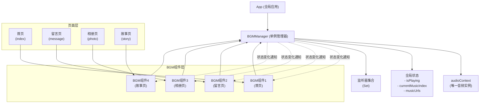
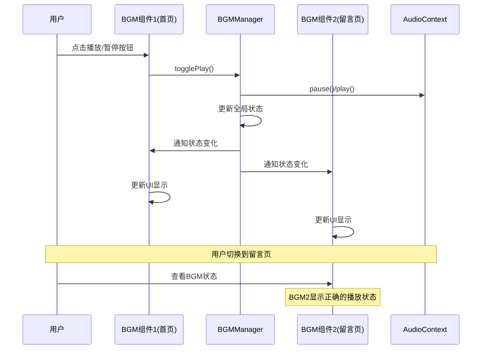
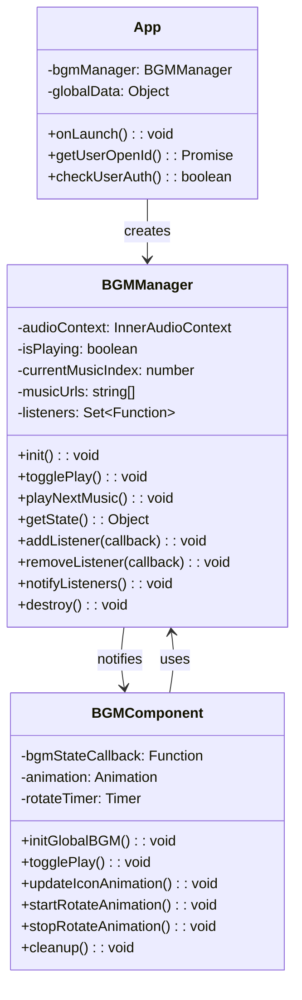

# BGM全局同步架构设计

## 架构图

## 数据流图

## 核心类图

## 实现原理

### 1. 单例模式
- BGMManager在App启动时创建唯一实例
- 所有BGM组件共享同一个音频上下文
- 避免多个音频实例同时播放的问题

### 2. 观察者模式
- BGM组件注册状态监听器到BGMManager
- 状态变化时，BGMManager通知所有监听器
- 实现跨组件的状态同步

### 3. 状态管理
- 全局状态：播放状态、当前歌曲索引、音乐列表
- 本地状态：动画状态、UI显示状态
- 状态分离确保数据一致性

### 4. 生命周期管理
- 组件attached时注册监听器
- 组件detached时清理监听器
- 避免内存泄漏和重复监听

## 优势

1. **状态一致性**：所有页面BGM状态完全同步
2. **性能优化**：单一音频实例，减少资源消耗
3. **用户体验**：页面切换时音乐状态保持连续
4. **代码维护**：集中管理，易于扩展和修改
5. **内存安全**：正确的资源清理，避免内存泄漏

@author tangxin
